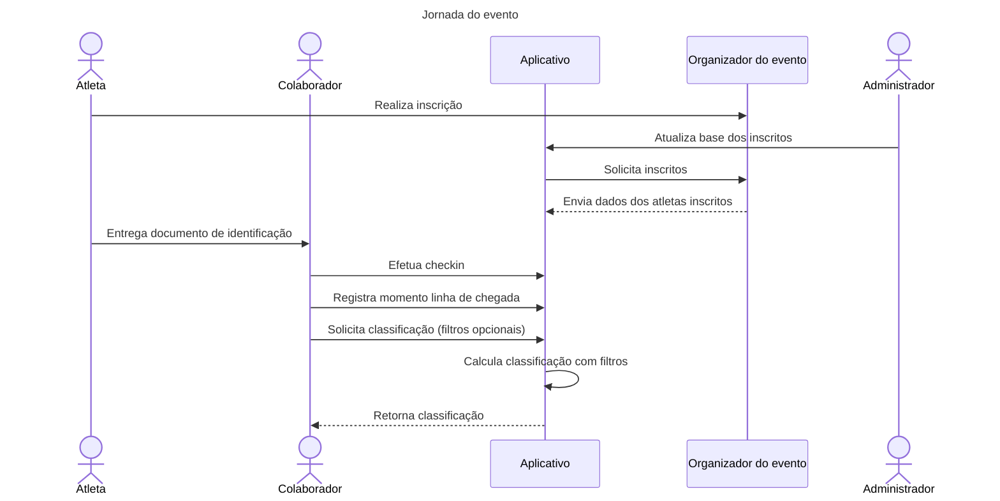

```mermaid
sequenceDiagram
    title Jornada do evento
    actor Atleta as Atleta
    actor Colaborador as Colaborador
    participant Aplicativo as Aplicativo
    participant Servico_Parceiro as Organizador do evento
    actor Admin as Administrador

%% Inscrição
    Atleta->>Servico_Parceiro: Realiza inscrição
    
%% Solução obtém dados do atleta
    Admin->>Aplicativo: Atualiza base dos inscritos
    Aplicativo->>Servico_Parceiro: Solicita inscritos
    Servico_Parceiro-->>Aplicativo: Envia dados dos atletas inscritos

%% Check-in
    Atleta->>Colaborador: Entrega documento de identificação
    Colaborador->>Aplicativo: Efetua checkin

%% Cronometragem
    Colaborador->>Aplicativo: Registra momento linha de chegada

%% Classificação
    Colaborador->>Aplicativo: Solicita classificação (filtros opcionais)
    Aplicativo->>Aplicativo: Calcula classificação com filtros
    Aplicativo-->>Colaborador: Retorna classificação

```