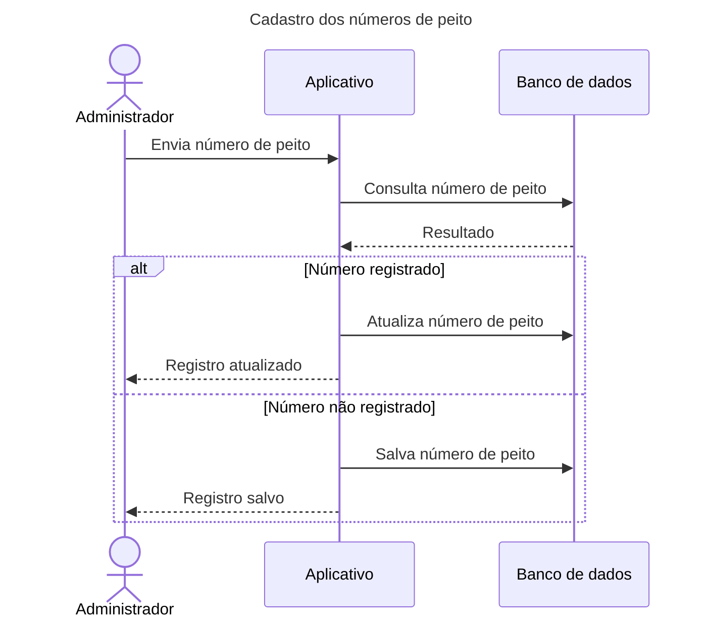

```mermaid
sequenceDiagram
    title Cadastro dos números de peito

    actor Admin as Administrador
    participant Aplicativo as Aplicativo
    participant DB as Banco de dados

    Admin->>Aplicativo: Envia número de peito
    Aplicativo->>DB: Consulta número de peito
    DB-->>Aplicativo: Resultado
    alt Número registrado
        Aplicativo->>DB: Atualiza número de peito
        Aplicativo-->>Admin: Registro atualizado
    else Número não registrado
        Aplicativo->>DB: Salva número de peito
        Aplicativo-->>Admin: Registro salvo
    end
    

```