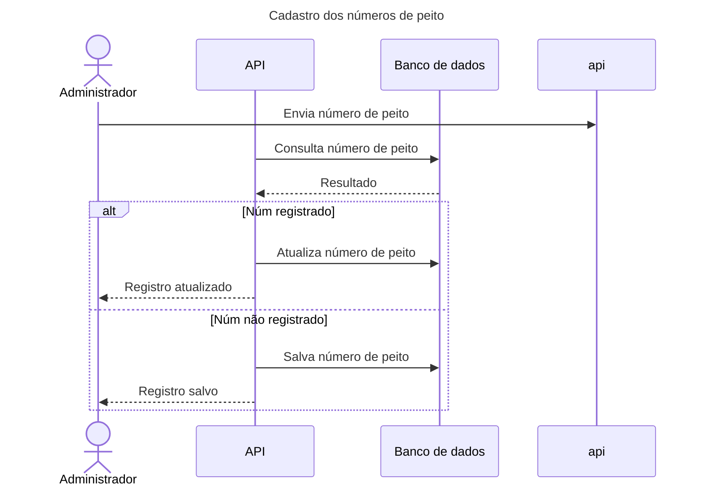

```mermaid
sequenceDiagram
    title Cadastro dos números de peito

    actor Admin as Administrador
    participant API as API
    participant DB as Banco de dados

    Admin->>api: Envia número de peito
    API->>DB: Consulta número de peito
    DB-->>API: Resultado
    alt Núm registrado
        API->>DB: Atualiza número de peito
        API-->>Admin: Registro atualizado
    else Núm não registrado
        API->>DB: Salva número de peito
        API-->>Admin: Registro salvo
    end
    

```