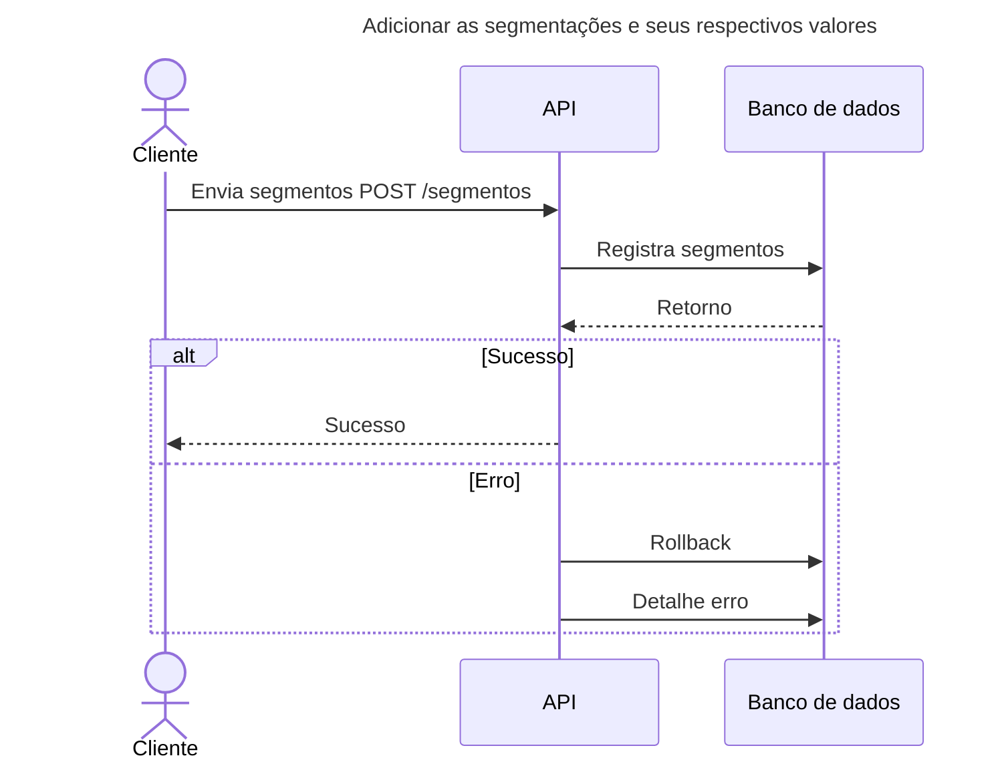

```mermaid
sequenceDiagram
    title Adicionar as segmentações e seus respectivos valores

    actor Client as Cliente
    participant API as API
    participant DB as Banco de dados

    Client->>API: Envia segmentos POST /segmentos
    API->>DB: Registra segmentos
    DB-->>API: Retorno
    alt Sucesso
        API-->>Client: Sucesso
    else Erro
        API->>DB: Rollback
        API->>DB: Detalhe erro
    end
```