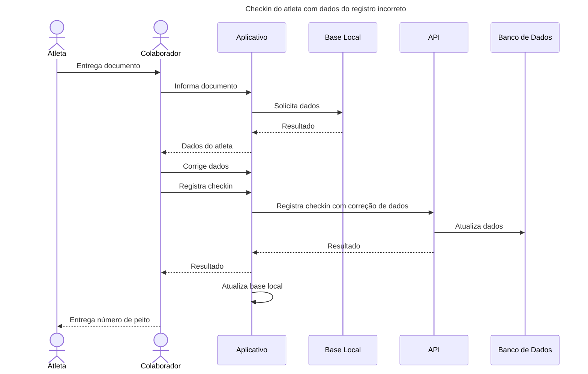

```mermaid
sequenceDiagram
    title Checkin do atleta com dados do registro incorreto

    actor Atleta as Atleta
    actor Colaborador as Colaborador
    participant Aplicativo as Aplicativo
    participant DB_LOCAL as Base Local
    participant API as API
    participant DB as Banco de Dados
    
    Atleta->>Colaborador: Entrega documento
    Colaborador->>Aplicativo: Informa documento
    Aplicativo->>DB_LOCAL: Solicita dados
    DB_LOCAL-->>Aplicativo: Resultado
    Aplicativo-->>Colaborador: Dados do atleta
    Colaborador->>Aplicativo: Corrige dados
    Colaborador->>Aplicativo: Registra checkin
    Aplicativo->>API: Registra checkin com correção de dados
    API->>DB: Atualiza dados
    API-->>Aplicativo: Resultado
    Aplicativo-->>Colaborador: Resultado
    Aplicativo->>Aplicativo: Atualiza base local
    Colaborador-->>Atleta: Entrega número de peito
```