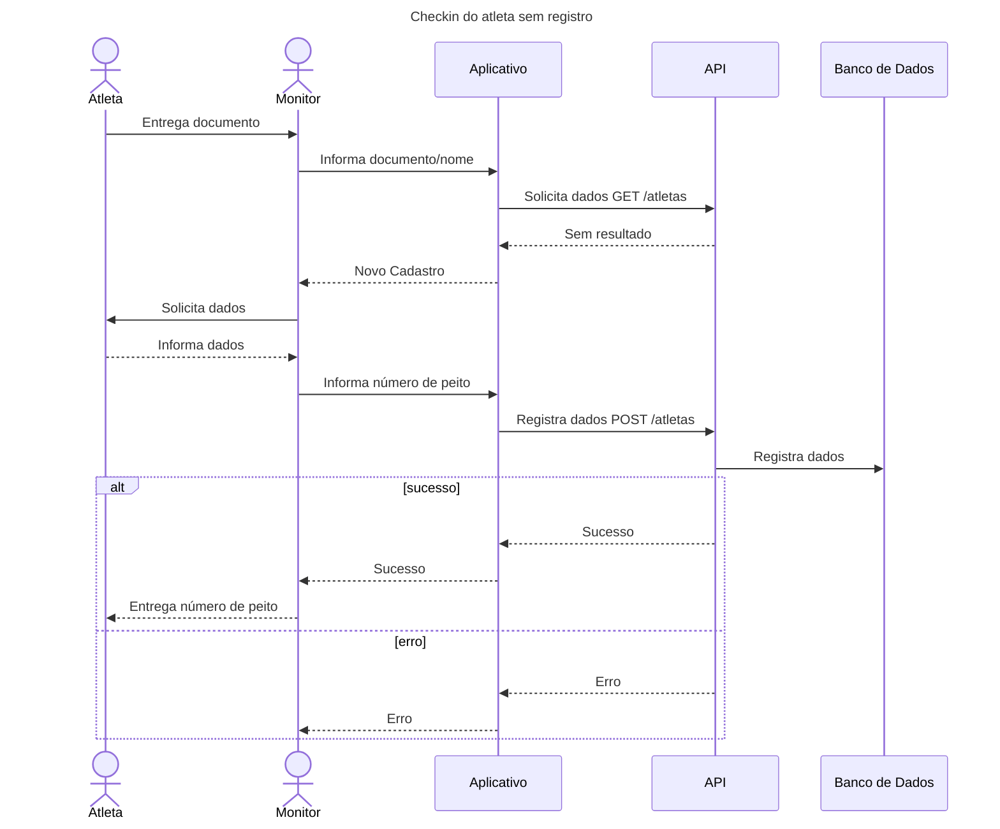

```mermaid
sequenceDiagram
    title Checkin do atleta sem registro

    actor Atleta as Atleta
    actor Monitor as Monitor
    participant Aplicativo as Aplicativo
    participant API as API
    participant DB as Banco de Dados

    Atleta->>Monitor: Entrega documento
    Monitor->>Aplicativo: Informa documento/nome
    Aplicativo->>API: Solicita dados GET /atletas
    API-->>Aplicativo: Sem resultado
    Aplicativo-->>Monitor: Novo Cadastro
    Monitor->>Atleta: Solicita dados
    Atleta-->>Monitor: Informa dados
    Monitor->>Aplicativo: Informa número de peito
    Aplicativo->>API: Registra dados POST /atletas
    API->>DB: Registra dados
    alt sucesso
        API-->>Aplicativo: Sucesso
        Aplicativo-->>Monitor: Sucesso
        Monitor-->>Atleta: Entrega número de peito
    else erro
        API-->>Aplicativo: Erro
        Aplicativo-->>Monitor: Erro
    end
```