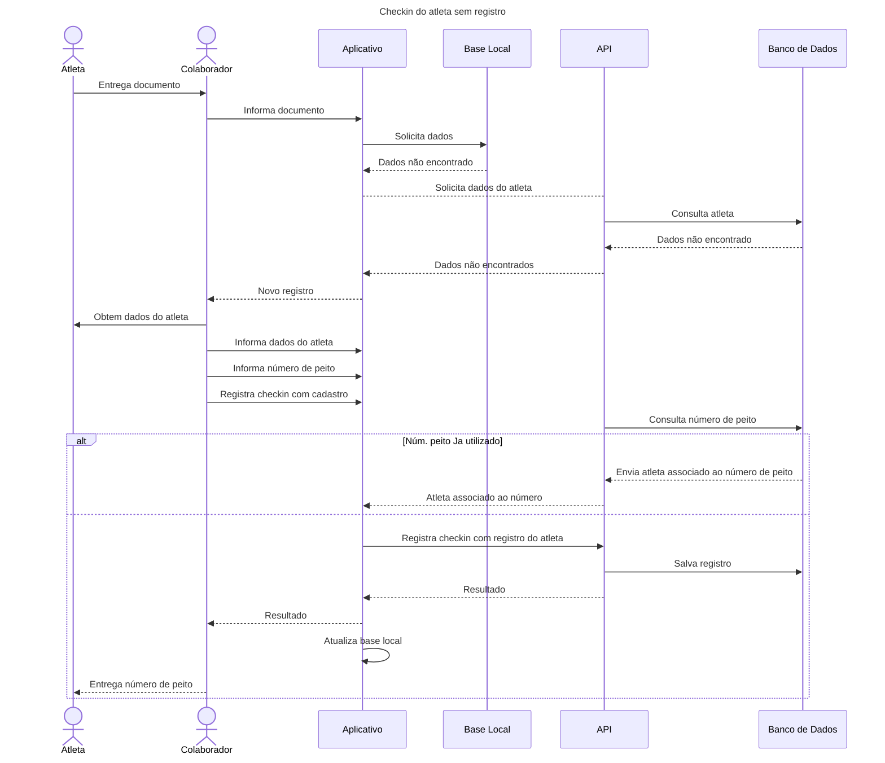

```mermaid
sequenceDiagram
    title Checkin do atleta sem registro

    actor Atleta as Atleta
    actor Colaborador as Colaborador
    participant Aplicativo as Aplicativo
    participant DB_LOCAL as Base Local
    participant API as API
    participant DB as Banco de Dados
    
    Atleta->>Colaborador: Entrega documento
    Colaborador->>Aplicativo: Informa documento
    Aplicativo->>DB_LOCAL: Solicita dados
    DB_LOCAL-->>Aplicativo: Dados não encontrado
    Aplicativo-->API: Solicita dados do atleta
    API->>DB: Consulta atleta
    DB-->>API: Dados não encontrado
    API-->>Aplicativo: Dados não encontrados
    Aplicativo-->>Colaborador: Novo registro
    Colaborador->>Atleta: Obtem dados do atleta
    Colaborador->>Aplicativo: Informa dados do atleta
    Colaborador->>Aplicativo: Informa número de peito
    Colaborador->>Aplicativo: Registra checkin com cadastro
    API->>DB: Consulta número de peito
    alt Núm. peito Ja utilizado
        DB-->>API: Envia atleta associado ao número de peito
        API-->>Aplicativo: Atleta associado ao número
    else
        Aplicativo->>API: Registra checkin com registro do atleta
        API->>DB: Salva registro
        API-->>Aplicativo: Resultado
        Aplicativo-->>Colaborador: Resultado
        Aplicativo->>Aplicativo: Atualiza base local
        Colaborador-->>Atleta: Entrega número de peito
    end
```