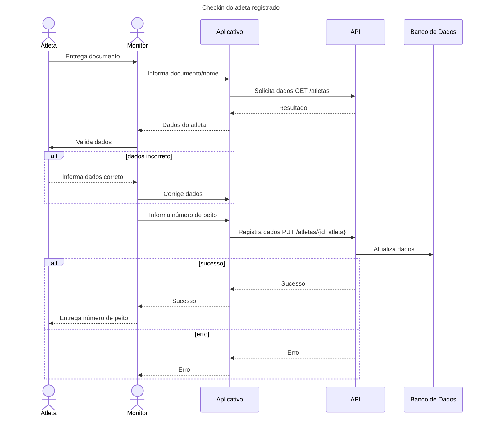

```mermaid
sequenceDiagram
    title Checkin do atleta registrado

    actor Atleta as Atleta
    actor Monitor as Monitor
    participant Aplicativo as Aplicativo
    participant API as API
    participant DB as Banco de Dados
    
    Atleta->>Monitor: Entrega documento
    Monitor->>Aplicativo: Informa documento/nome
    Aplicativo->>API: Solicita dados GET /atletas
    API-->>Aplicativo: Resultado
    Aplicativo-->>Monitor: Dados do atleta
    Monitor->>Atleta: Valida dados
    alt dados incorreto
        Atleta-->>Monitor: Informa dados correto
        Monitor->>Aplicativo: Corrige dados
    end
    Monitor->>Aplicativo: Informa número de peito
    Aplicativo->>API: Registra dados PUT /atletas/{id_atleta}
    API->>DB: Atualiza dados
    alt sucesso
        API-->>Aplicativo: Sucesso
        Aplicativo-->>Monitor: Sucesso
        Monitor-->>Atleta: Entrega número de peito
    else erro
        API-->>Aplicativo: Erro
        Aplicativo-->>Monitor: Erro
    end
```