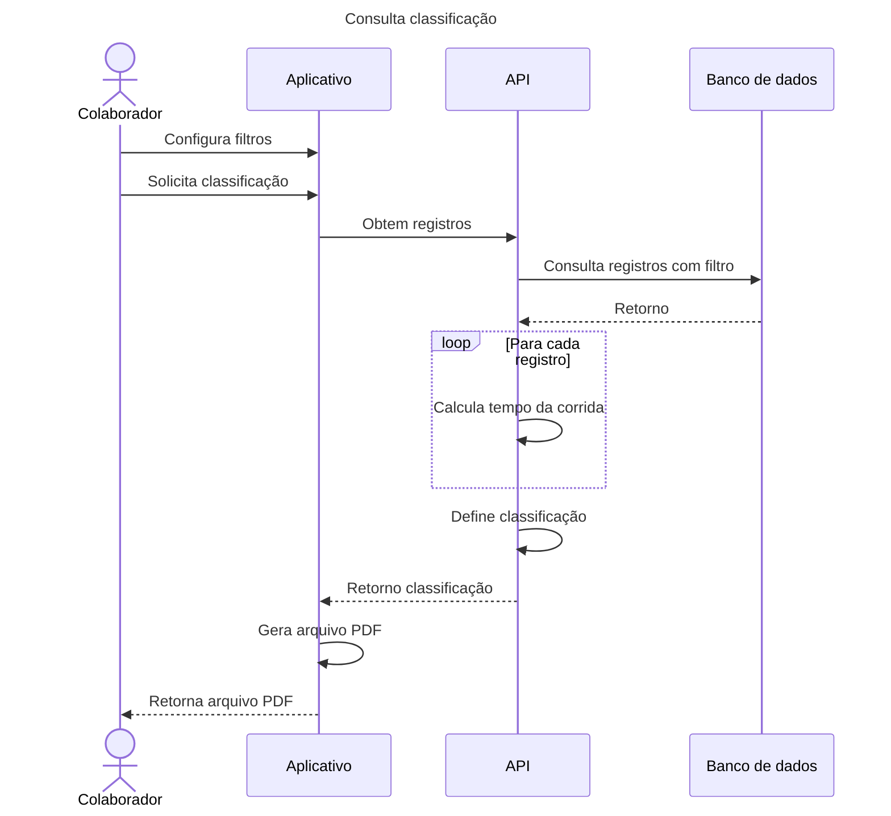

```mermaid
sequenceDiagram
    title Consulta classificação

    actor Colaborador as Colaborador
    participant Aplicativo as Aplicativo
    participant API as API
    participant DB as Banco de dados

    Colaborador->>Aplicativo: Configura filtros
    Colaborador->>Aplicativo: Solicita classificação
    Aplicativo->>API: Obtem registros
    API->>DB: Consulta registros com filtro
    DB-->>API: Retorno
    loop Para cada registro
        API->>API: Calcula tempo da corrida
    end
    API->>API: Define classificação
    API-->>Aplicativo: Retorno classificação
    Aplicativo->>Aplicativo: Gera arquivo PDF
    Aplicativo-->>Colaborador: Retorna arquivo PDF
```