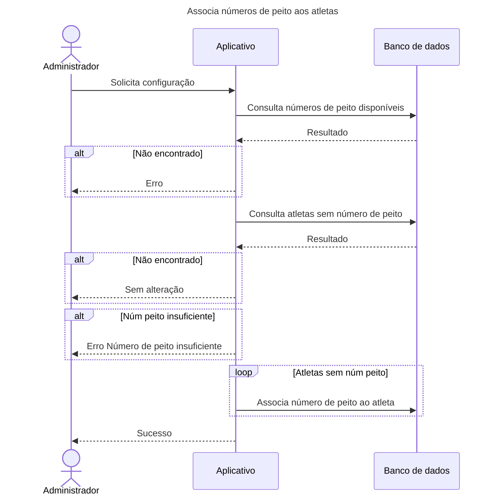

```mermaid
sequenceDiagram
    title Associa números de peito aos atletas

    actor Admin as Administrador
    participant Aplicativo as Aplicativo
    participant DB as Banco de dados

    Admin->>Aplicativo: Solicita configuração
    Aplicativo->>DB: Consulta números de peito disponíveis
    DB-->>Aplicativo: Resultado
    alt Não encontrado
        Aplicativo-->>Admin: Erro
    end
    Aplicativo->>DB: Consulta atletas sem número de peito
    DB-->>Aplicativo: Resultado
    alt Não encontrado
        Aplicativo-->>Admin: Sem alteração
    end
    alt Núm peito insuficiente
        Aplicativo-->>Admin: Erro Número de peito insuficiente
    end
    loop Atletas sem núm peito
        Aplicativo->>DB: Associa número de peito ao atleta
    end
    Aplicativo-->>Admin: Sucesso
```