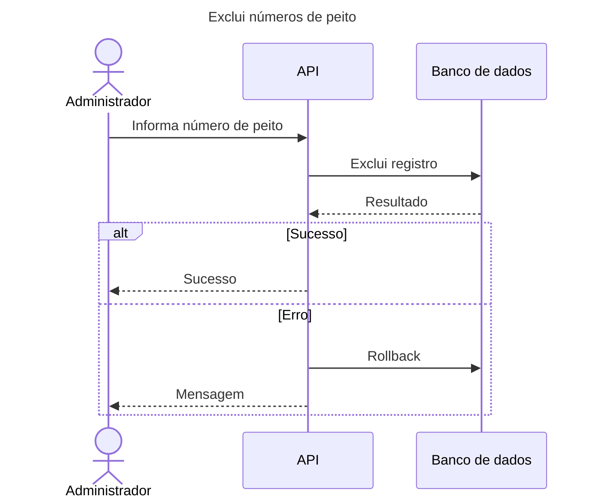

```mermaid
sequenceDiagram
    title Exclui números de peito

    actor Admin as Administrador
    participant API as API
    participant DB as Banco de dados

    Admin->>API: Informa número de peito
    API->>DB: Exclui registro
    DB-->>API: Resultado
    alt Sucesso
        API-->>Admin: Sucesso
    else Erro
        API->>DB: Rollback
        API-->>Admin: Mensagem
    end
```