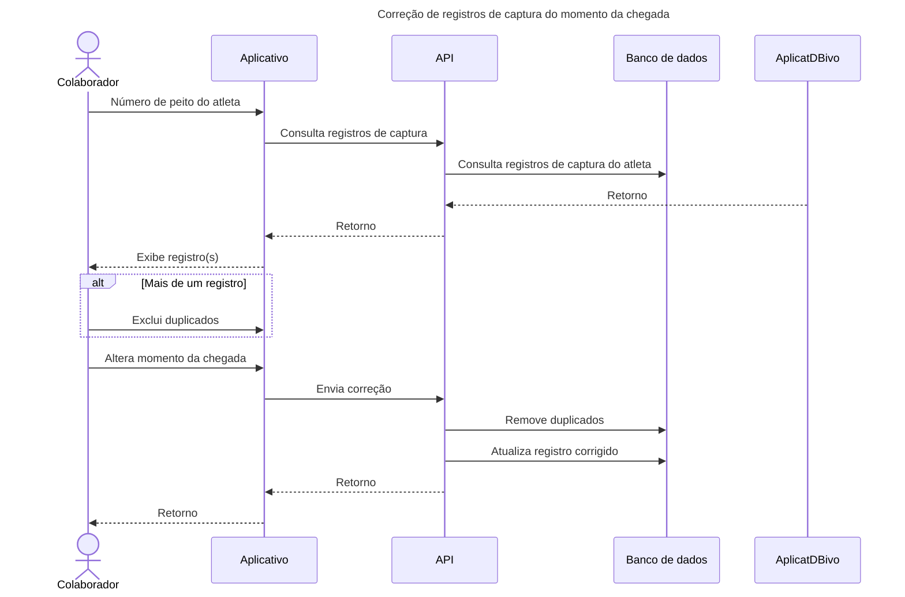

```mermaid
sequenceDiagram
    title Correção de registros de captura do momento da chegada

    actor Colaborador as Colaborador
    participant Aplicativo as Aplicativo
    participant API as API
    participant DB as Banco de dados

    Colaborador->>Aplicativo: Número de peito do atleta
    Aplicativo->>API: Consulta registros de captura
    API->>DB: Consulta registros de captura do atleta
    AplicatDBivo-->>API: Retorno
    API-->>Aplicativo: Retorno
    Aplicativo-->>Colaborador: Exibe registro(s)
    alt Mais de um registro
        Colaborador->>Aplicativo: Exclui duplicados
    end
    Colaborador->>Aplicativo: Altera momento da chegada
    Aplicativo->>API: Envia correção
    API->>DB: Remove duplicados
    API->>DB: Atualiza registro corrigido
    API-->>Aplicativo: Retorno
    Aplicativo-->>Colaborador: Retorno
```