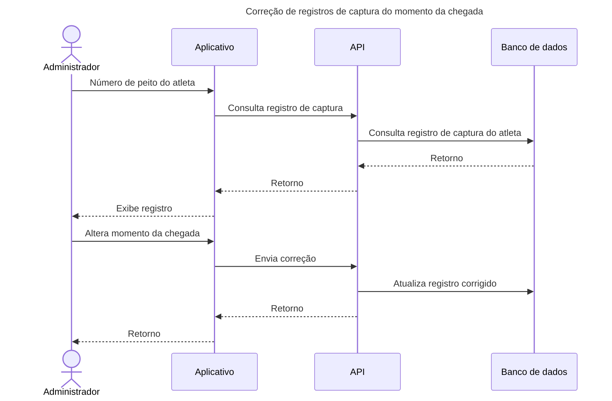

```mermaid
sequenceDiagram
    title Correção de registros de captura do momento da chegada

    actor Admin as Administrador
    participant Aplicativo as Aplicativo
    participant API as API
    participant DB as Banco de dados

    Admin->>Aplicativo: Número de peito do atleta
    Aplicativo->>API: Consulta registro de captura
    API->>DB: Consulta registro de captura do atleta
    DB-->>API: Retorno
    API-->>Aplicativo: Retorno
    Aplicativo-->>Admin: Exibe registro
    Admin->>Aplicativo: Altera momento da chegada
    Aplicativo->>API: Envia correção
    API->>DB: Atualiza registro corrigido
    API-->>Aplicativo: Retorno
    Aplicativo-->>Admin: Retorno
```