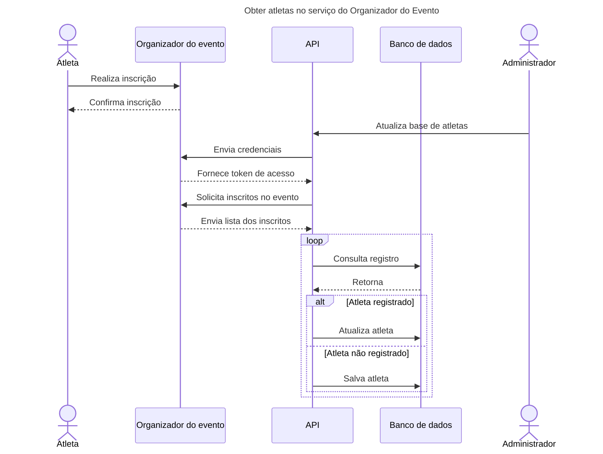

```mermaid
sequenceDiagram
    title Obter atletas no serviço do Organizador do Evento
    
    actor Atleta as Atleta
    participant Servico_Parceiro as Organizador do evento
    participant API as API
    participant DB as Banco de dados
    actor Admin as Administrador

%% Inscrição
    Atleta->>Servico_Parceiro: Realiza inscrição
    Servico_Parceiro-->>Atleta: Confirma inscrição

%% Obtém dados
    Admin->>API: Atualiza base de atletas
    API->>Servico_Parceiro: Envia credenciais
    Servico_Parceiro-->>API: Fornece token de acesso
    API->>Servico_Parceiro: Solicita inscritos no evento
    Servico_Parceiro-->>API: Envia lista dos inscritos

%% Atualiza registros
    loop
        API->>DB: Consulta registro
        DB-->>API: Retorna
        alt Atleta registrado
            API->>DB: Atualiza atleta
        else Atleta não registrado
            API->>DB: Salva atleta
        end
    end


```