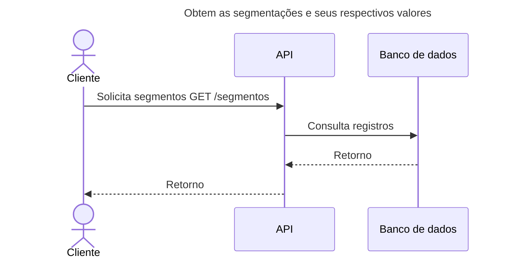

```mermaid
sequenceDiagram
    title Obtem as segmentações e seus respectivos valores

    actor Client as Cliente
    participant API as API
    participant DB as Banco de dados

    Client->>API: Solicita segmentos GET /segmentos
    API->>DB: Consulta registros
    DB-->>API: Retorno
    API-->>Client: Retorno
```