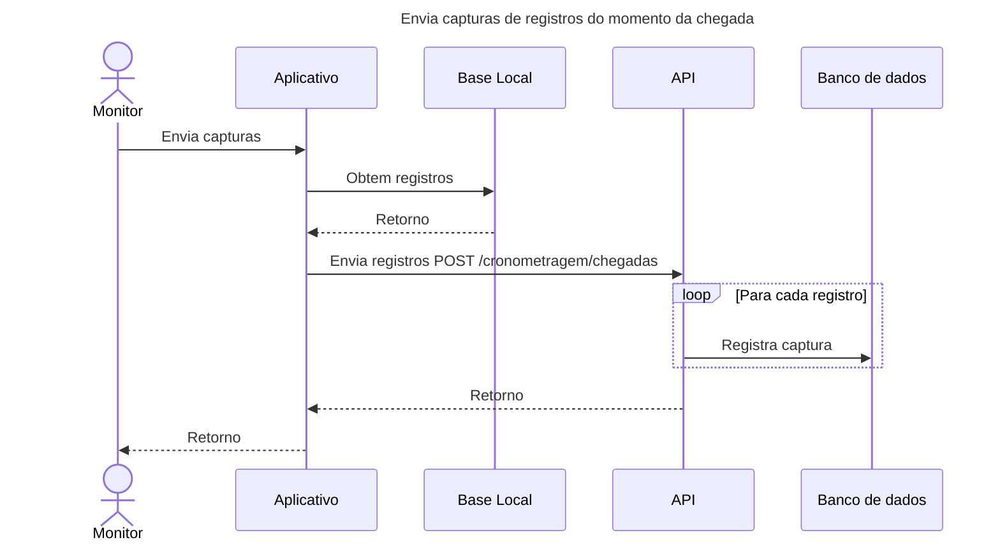

```mermaid
sequenceDiagram
    title Envia capturas de registros do momento da chegada

    actor Monitor as Monitor
    participant Aplicativo as Aplicativo
    participant DB_LOCAL as Base Local
    participant API as API
    participant DB as Banco de dados

    Monitor->>Aplicativo: Envia capturas
    Aplicativo->>DB_LOCAL: Obtem registros
    DB_LOCAL-->>Aplicativo: Retorno
    Aplicativo->>API: Envia registros POST /cronometragem/chegadas
    loop Para cada registro
        API->>DB: Registra captura
    end
    API-->>Aplicativo: Retorno
    Aplicativo-->>Monitor: Retorno
```