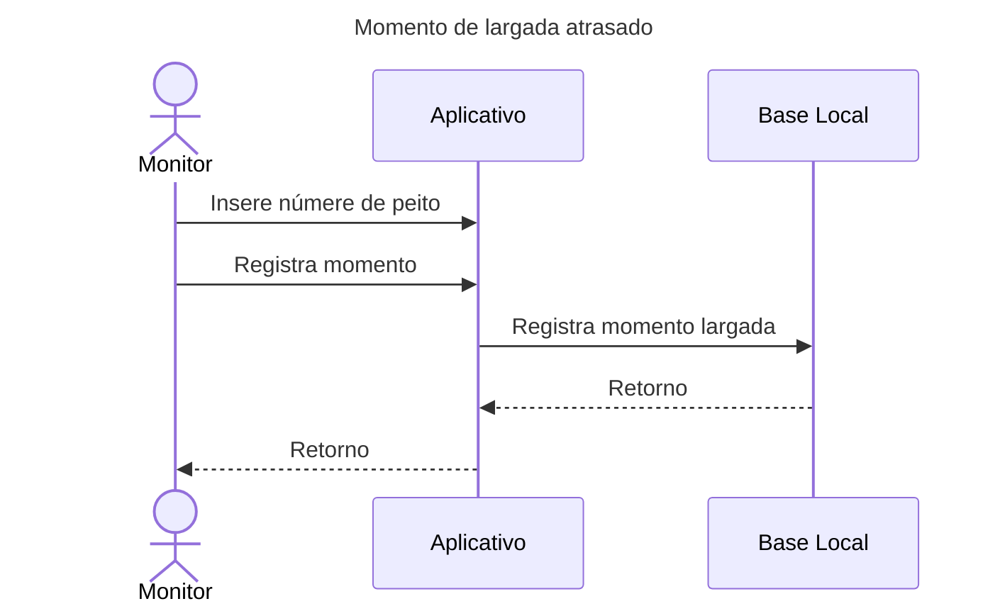

```mermaid
sequenceDiagram
    title Momento de largada atrasado

    actor Monitor as Monitor
    participant Aplicativo as Aplicativo
    participant DB_LOCAL as Base Local

    Monitor->>Aplicativo: Insere númere de peito
    Monitor->>Aplicativo: Registra momento
    Aplicativo->>DB_LOCAL: Registra momento largada
    DB_LOCAL-->>Aplicativo: Retorno
    Aplicativo-->>Monitor: Retorno
```