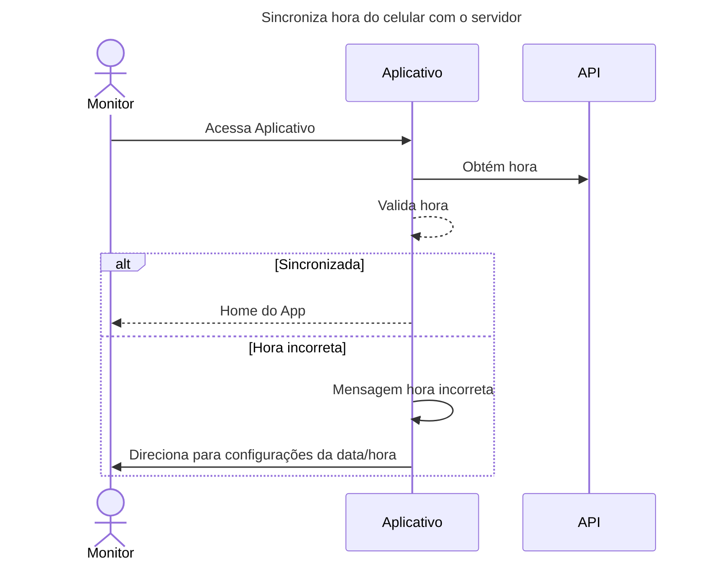

```mermaid
sequenceDiagram
    title Sincroniza hora do celular com o servidor

    actor Monitor as Monitor
    participant Aplicativo as Aplicativo
    participant API as API

    Monitor->>Aplicativo: Acessa Aplicativo
    Aplicativo->>API: Obtém hora
    Aplicativo-->>Aplicativo: Valida hora
    alt Sincronizada
        Aplicativo-->>Monitor: Home do App
    else Hora incorreta
        Aplicativo->>Aplicativo: Mensagem hora incorreta
        Aplicativo->>Monitor: Direciona para configurações da data/hora
    end
```