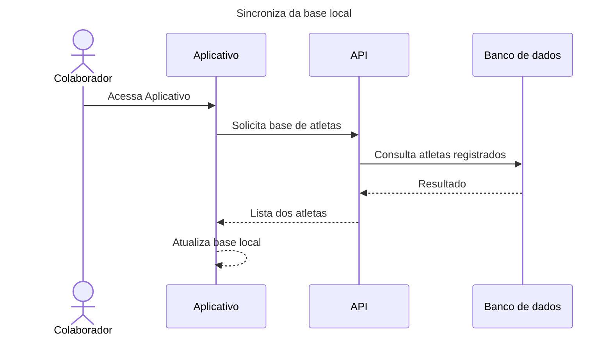

```mermaid
sequenceDiagram
    title Sincroniza da base local

    actor Colaborador as Colaborador
    participant Aplicativo as Aplicativo
    participant API as API
    participant DB as Banco de dados

    Colaborador->>Aplicativo: Acessa Aplicativo
    Aplicativo->>API: Solicita base de atletas
    API->>DB: Consulta atletas registrados
    DB-->>API: Resultado
    API-->>Aplicativo: Lista dos atletas
    Aplicativo-->>Aplicativo: Atualiza base local
```