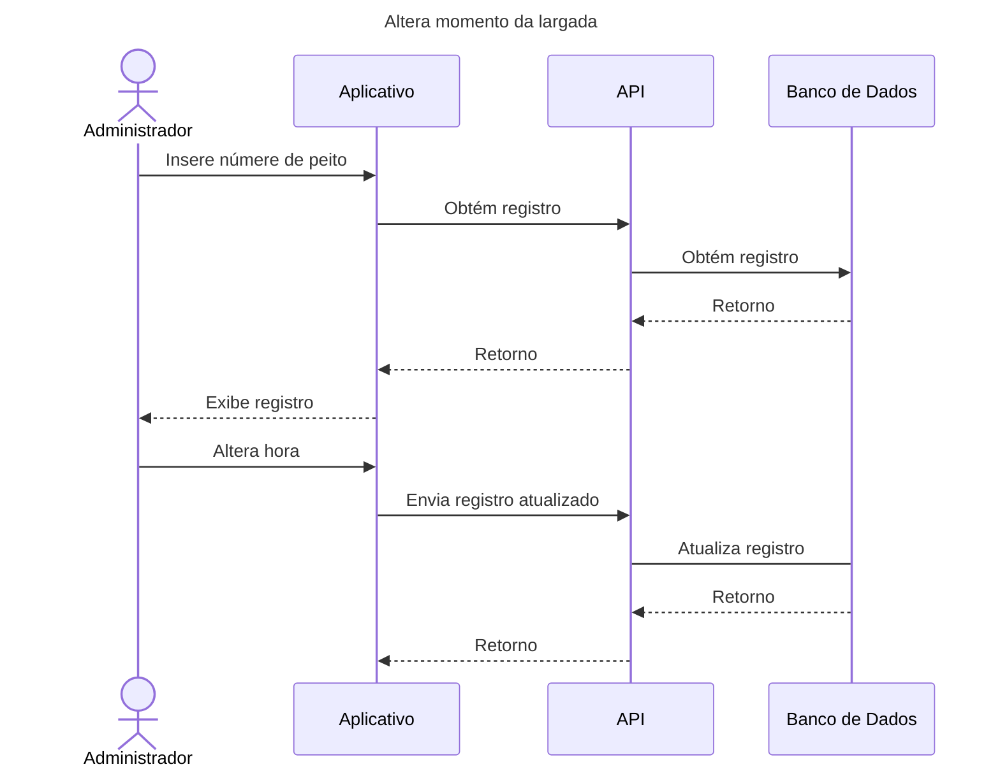

```mermaid
sequenceDiagram
    title Altera momento da largada

    actor Admin as Administrador
    participant Aplicativo as Aplicativo
    participant Api as API
    participant DB as Banco de Dados

    Admin->>Aplicativo: Insere númere de peito
    Aplicativo->>Api: Obtém registro
    Api->>DB: Obtém registro
    DB-->>Api: Retorno
    Api-->>Aplicativo: Retorno
    Aplicativo-->>Admin: Exibe registro
    Admin->>Aplicativo: Altera hora
    Aplicativo->>Api: Envia registro atualizado
    Api->DB: Atualiza registro
    DB-->>Api: Retorno
    Api-->>Aplicativo: Retorno
```