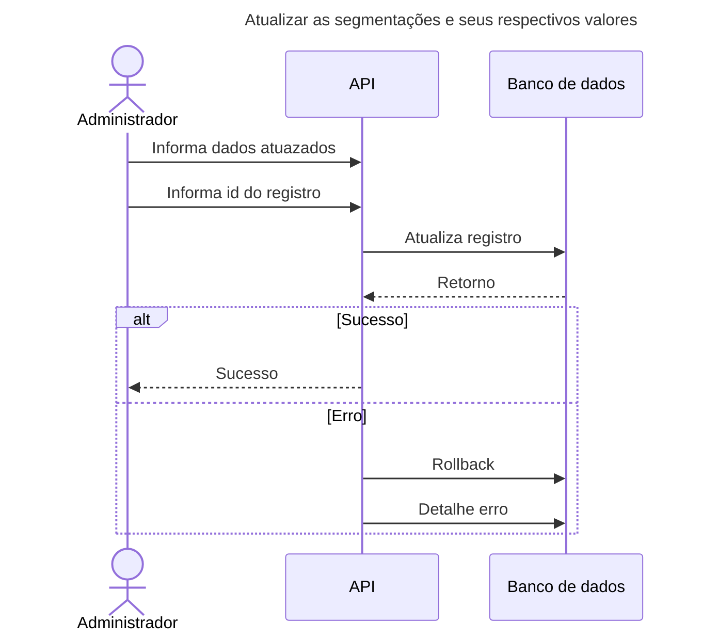

```mermaid
sequenceDiagram
    title Atualizar as segmentações e seus respectivos valores

    actor Admin as Administrador
    participant API as API
    participant DB as Banco de dados

    Admin->>API: Informa dados atuazados
    Admin->>API: Informa id do registro
    API->>DB: Atualiza registro
    DB-->>API: Retorno
    alt Sucesso
        API-->>Admin: Sucesso
    else Erro
        API->>DB: Rollback
        API->>DB: Detalhe erro
    end
```