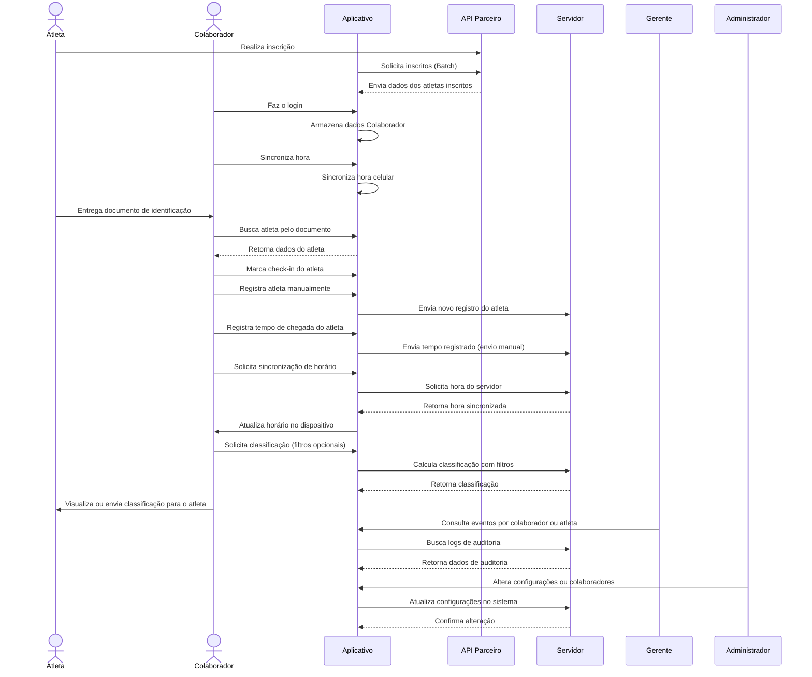

### Sequencia dos processos

```mermaid
sequenceDiagram
    actor Atleta as Atleta
    actor Colaborador as Colaborador
    participant Aplicativo as Aplicativo
    participant API_Parceiro as API Parceiro

%% Inscrição
    Atleta->>API_Parceiro: Realiza inscrição
    Aplicativo->>API_Parceiro: Solicita inscritos (Batch)
    API_Parceiro-->>Aplicativo: Envia dados dos atletas inscritos

%% Abertura do Aplicativo
    Colaborador->>Aplicativo: Faz o login
    Aplicativo->>Aplicativo: Armazena dados Colaborador

%% Sincronizar Hora
    Colaborador->>Aplicativo: Sincroniza hora
    Aplicativo->>Aplicativo: Sincroniza hora celular
    
%% Check-in
    Atleta->>Colaborador: Entrega documento de identificação
    Colaborador->>Aplicativo: Busca atleta pelo documento
    Aplicativo-->>Colaborador: Retorna dados do atleta
    Colaborador->>Aplicativo: Marca check-in do atleta

%% Check-in sem inscrição
    Colaborador->>Aplicativo: Registra atleta manualmente
    Aplicativo->>Servidor: Envia novo registro do atleta

%% Cronometragem
    Colaborador->>Aplicativo: Registra tempo de chegada do atleta
    Aplicativo->>Servidor: Envia tempo registrado (envio manual)

%% Sincronização do horário
    Colaborador->>Aplicativo: Solicita sincronização de horário
    Aplicativo->>Servidor: Solicita hora do servidor
    Servidor-->>Aplicativo: Retorna hora sincronizada
    Aplicativo->>Colaborador: Atualiza horário no dispositivo

%% Classificação
    Colaborador->>Aplicativo: Solicita classificação (filtros opcionais)
    Aplicativo->>Servidor: Calcula classificação com filtros
    Servidor-->>Aplicativo: Retorna classificação
    Colaborador->>Atleta: Visualiza ou envia classificação para o atleta

%% Auditoria
    Gerente->>Aplicativo: Consulta eventos por colaborador ou atleta
    Aplicativo->>Servidor: Busca logs de auditoria
    Servidor-->>Aplicativo: Retorna dados de auditoria

%% Configuração
    Administrador->>Aplicativo: Altera configurações ou colaboradores
    Aplicativo->>Servidor: Atualiza configurações no sistema
    Servidor-->>Aplicativo: Confirma alteração

```