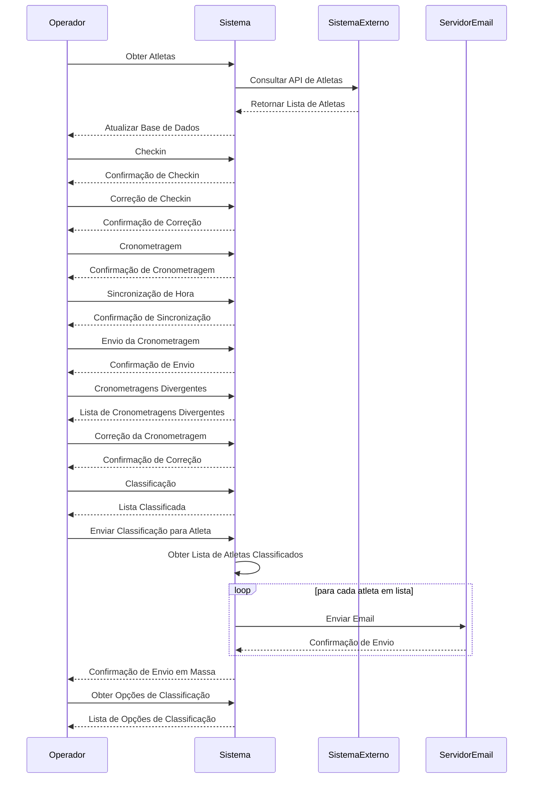

### Caso de uso

Versão 1

```mermaid
sequenceDiagram
    participant Operador
    participant Sistema
    participant SistemaExterno
    participant ServidorEmail

    Operador->>Sistema: Obter Atletas
    Sistema->>SistemaExterno: Consultar API de Atletas
    SistemaExterno-->>Sistema: Retornar Lista de Atletas
    Sistema-->>Operador: Atualizar Base de Dados

    Operador->>Sistema: Checkin
    Sistema-->>Operador: Confirmação de Checkin

    Operador->>Sistema: Correção de Checkin
    Sistema-->>Operador: Confirmação de Correção

    Operador->>Sistema: Cronometragem
    Sistema-->>Operador: Confirmação de Cronometragem

    Operador->>Sistema: Sincronização de Hora
    Sistema-->>Operador: Confirmação de Sincronização

    Operador->>Sistema: Envio da Cronometragem
    Sistema-->>Operador: Confirmação de Envio

    Operador->>Sistema: Cronometragens Divergentes
    Sistema-->>Operador: Lista de Cronometragens Divergentes

    Operador->>Sistema: Correção da Cronometragem
    Sistema-->>Operador: Confirmação de Correção

    Operador->>Sistema: Classificação
    Sistema-->>Operador: Lista Classificada

    Operador->>Sistema: Enviar Classificação para Atleta
    Sistema->>Sistema: Obter Lista de Atletas Classificados
    loop para cada atleta em lista
        Sistema->>ServidorEmail: Enviar Email
        ServidorEmail-->>Sistema: Confirmação de Envio
    end
    Sistema-->>Operador: Confirmação de Envio em Massa

    Operador->>Sistema: Obter Opções de Classificação
    Sistema-->>Operador: Lista de Opções de Classificação

```